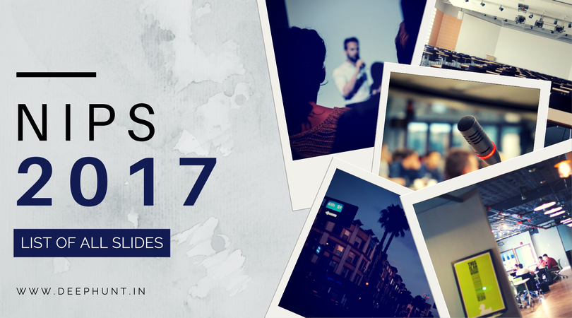

# NIPS 2017

This year's Neural Information Processing Systems (NIPS) 2017 conference held at Long Beach Convention Center, Long Beach California has been the biggest ever! Here's a list of resources and slides of all invited talks, tutorials and workshops.

Contributions are welcome. You can add links via pull requests or create an issue to lemme know something I missed or to start a discussion. If you know the speakers, please ask them to upload slides online!

Check out [Deep Hunt](https://www.deephunt.in) - a curated monthly AI newsletter for this repo as a [blog post](https://deephunt.in/nips-2017-e580ebc9c7b2) and follow me on [Twitter](https://www.twitter.com/hindupuravinash).

## Contents

- [Invited Talks](#invited-talks)

- [Tutorials](#tutorials)

- [Workshops](#workshops)

- [WiML](#wiml)

## Invited Talks

- **Powering the next 100 years**

  John Platt

  Slides · [Video](https://www.youtube.com/watch?v=HL60wgrT67k) · Code

- **Why AI Will Make it Possible to Reprogram the Human Genome**

  Brendan J Frey

  [Video](https://www.youtube.com/watch?v=QJLQBSQJEus)

- **The Trouble with Bias**

  Kate Crawford

  [Video](https://www.youtube.com/watch?v=fMym_BKWQzk)

- **The Unreasonable Effectiveness of Structure**

  Lise Getoor

  Slides · [Video](https://www.youtube.com/watch?v=t4k5LKCpboc)

- **Deep Learning for Robotics**

  Pieter Abbeel

  [Slides](https://www.dropbox.com/s/fdw7q8mx3x4wr0c/2017_12_xx_NIPS-keynote-final.pdf) · [Video](https://www.youtube.com/watch?v=po9z_tMuEwE) · Code

- **Learning State Representations**

  Yael Niv
  
  [Video](https://www.youtube.com/watch?v=FhOwFDGm0d4)

- **On Bayesian Deep Learning and Deep Bayesian Learning**

  Yee Whye Teh

  [Video](https://www.youtube.com/watch?v=9saauSBgmcQ)

## Tutorials

- **Deep Learning: Practice and Trends**

  Nando de Freitas · Scott Reed · Oriol Vinyals

  [Slides](https://drive.google.com/file/d/1SuwiICLERd7SfYo3FiqNG0tCEBUjKcT7/view) · [Video](https://www.youtube.com/watch?v=YJnddoa8sHk) · Code

- **Reinforcement Learning with People**

  Emma Brunskill

  Slides · [Video](https://www.youtube.com/watch?v=TqT9nIx27Eg) · Code

- **A Primer on Optimal Transport**

  Marco Cuturi · Justin M Solomon

  [Slides](https://www.dropbox.com/s/55tb2cf3zipl6xu/aprimeronOT.pdf) · Video · Code

- **Deep Probabilistic Modelling with Gaussian Processes**

  Neil D Lawrence

  [Slides](http://inverseprobability.com/talks/lawrence-nips17/deep-probabilistic-modelling-with-gaussian-processes.html) · [Video](https://www.youtube.com/watch?v=RAiPlfohjJo) · Code    

- **Fairness in Machine Learning**

  Solon Barocas · Moritz Hardt

  [Slides](http://mrtz.org/nips17/#/) · Video · Code

- **Statistical Relational Artificial Intelligence: Logic, Probability and Computation**

  Luc De Raedt · David Poole · Kristian Kersting · Sriraam Natarajan

  Slides · Video · Code

- **Engineering and Reverse-Engineering Intelligence Using Probabilistic Programs, Program Induction, and Deep Learning**

  Josh Tenenbaum · Vikash K Mansinghka

  Slides · Video · Code

- **Differentially Private Machine Learning: Theory, Algorithms and Applications**

  Kamalika Chaudhuri · Anand D Sarwate

  [Slides](http://www.ece.rutgers.edu/~asarwate/nips2017/NIPS17_DPML_Tutorial.pdf) · Video · Code

- **Geometric Deep Learning on Graphs and Manifolds**

  Michael Bronstein · Joan Bruna · arthur szlam · Xavier Bresson · Yann LeCun

  [Slides](http://geometricdeeplearning.com/slides/NIPS-GDL.pdf) · [Video](https://www.youtube.com/watch?v=LvmjbXZyoP0) · Code
  ​            
## Workshops

- ### [ML Systems Workshop @ NIPS 2017](http://learningsys.org/nips17/index.html)

  Aparna Lakshmiratan · Sarah Bird · Siddhartha Sen · Christopher Ré · Li Erran Li · Joseph Gonzalez · Daniel Crankshaw

  - A distributed execution engine for emerging AI applications

    Ion Stoica

  - The Case for Learning Database Indexes    

  - [Federated Multi-Task Learning](http://learningsys.org/nips17/assets/slides/mocha-NIPS.pdf)

    Virginia Smith

  - [Accelerating Persistent Neural Networks at Datacenter Scale](http://learningsys.org/nips17/assets/slides/brainwave-nips17.pdf)

    Daniel Lo

  - [DLVM: A modern compiler framework for neural network DSLs](http://learningsys.org/nips17/assets/slides/dlvm-nips17.pdf)

    Richard Wei · Lane Schwartz · Vikram Adve

  - [Machine Learning for Systems and Systems for Machine Learning](http://learningsys.org/nips17/assets/slides/dean-nips17.pdf)

    Jeff Dean

  - [Creating an Open and Flexible ecosystem for AI models with ONNX](http://learningsys.org/nips17/assets/slides/ONNX-workshop.pdf)

    Sarah Bird · Dmytro Dzhulgakov 

  - [NSML: A Machine Learning Platform That Enables You to Focus on Your Models](http://learningsys.org/nips17/assets/slides/nsml_slides.pdf)

     Nako Sung

  - [DAWNBench: An End-to-End Deep Learning Benchmark and Competition](http://learningsys.org/nips17/assets/slides/dawn-nips17.pptx)

    Cody Coleman

- ### [Bayesian Deep Learning](http://bayesiandeeplearning.org/)

  Yarin Gal · José Miguel Hernández-Lobato · Christos Louizos · Andrew G Wilson · Diederik P. (Durk) Kingma · Zoubin Ghahramani · Kevin P Murphy · Max Welling

  - [Why Aren't You Using Probabilistic Programming?](http://dustintran.com/talks/Tran_Probabilistic_Programming.pdf)

    Dustin Tran

  - Automatic Model Selection in BNNs with Horseshoe Priors  

    Finale Doshi

  - Deep Bayes for Distributed Learning, Uncertainty Quantification and Compression

    Max Welling 

  - Stochastic Gradient Descent as Approximate Bayesian Inference  

    Matt Hoffman

  - [Recent Advances in Autoregressive Generative Models](https://drive.google.com/file/d/11CNWY5op_J5PvP02J9g8tciAom-MW9MZ/view)

    Nal Kalchbrenner

  - Deep Kernel Learning  

    Russ Salakhutdinov

  - Bayes by Backprop

    Meire Fortunato

  - How do the Deep Learning layers converge to the Information Bottleneck limit by Stochastic Gradient Descent?  

    Naftali (Tali) Tishby 

- ### [Learning with Limited Labeled Data: Weak Supervision and Beyond](https://lld-workshop.github.io/)

  Isabelle Augenstein · Stephen Bach · Eugene Belilovsky · Matthew Blaschko · Christoph Lampert · Edouard Oyallon · Emmanouil Antonios Platanios · Alexander Ratner · Christopher Ré

  - [Welcome Note](https://lld-workshop.github.io/slides/opening.pdf)

  - [Tales from fMRI: Learning from limited labeled data](https://lld-workshop.github.io/slides/gael_varoquaux_lld.pdf)   

    Gaël Varoquaux 

  - [Learning from Limited Labeled Data (But a Lot of Unlabeled Data)](https://lld-workshop.github.io/slides/tom_mitchell_lld.pdf)

    Tom Mitchell

  - [Light Supervision of Structured Prediction Energy Networks](https://lld-workshop.github.io/slides/andrew_mccallum_lld.pdf)

    Andrew McCallum

  - [Forcing Neural Link Predictors to Play by the Rules](https://lld-workshop.github.io/slides/sebastian_riedel_lld.pdf)

    Sebastian Riedel

  - [Panel: Limited Labeled Data in Medical Imaging](https://lld-workshop.github.io/slides/radiology_panel_lld.pdf)

    Daniel Rubin · Matt Lungren · Ina Fiterau

  - [Sample and Computationally Efficient Active Learning Algorithms](https://lld-workshop.github.io/slides/nina_balcan_lld.pdf)

    Nina Balcan

  - [That Doesn't Make Sense! A Case Study in Actively Annotating Model Explanations](https://lld-workshop.github.io/slides/sameer_singh_lld.pdf)

     Sameer Singh

  - [Overcoming Limited Data with GANs](http://www.iangoodfellow.com/slides/2017-12-09-label.pdf)

    Ian Goodfellow

  - [What’s so Hard About Natural Language Understanding?](https://lld-workshop.github.io/slides/alan_ritter_lld.pdf)

    Alan Ritter

  - [Closing Remarks](https://lld-workshop.github.io/slides/closing.pdf)

- ### [Advances in Approximate Bayesian Inference](http://approximateinference.org/)

  Francisco Ruiz · Stephan Mandt · Cheng Zhang · James McInerney · Dustin Tran · Tamara Broderick · Michalis Titsias · David Blei · Max Welling

  - [Learning priors, likelihoods, or posteriors](http://approximateinference.org/2017/schedule/Murray2017.pdf)

    Iain Murray

  - Learning Implicit Generative Models Using Differentiable Graph Tests

    Josip Djolonga 

  - [Gradient Estimators for Implicit Models)](http://approximateinference.org/2017/schedule/Li2017.pdf)

    Yingzhen Li

  - Variational Autoencoders for Recommendation

    Dawen Liang

  - [Approximate Inference in Industry: Two Applications at Amazon](http://approximateinference.org/2017/schedule/Archambeau2017.pdf)

    Cedric Archambeau

  - [Variational Inference based on Robust Divergences](http://approximateinference.org/2017/schedule/Futami2017.pdf)

    Futoshi Futami

  - [Adversarial Sequential Monte Carlo](http://approximateinference.org/2017/schedule/Kempinska2017.pdf)

    Kira Kempinska

  - [Scalable Logit Gaussian Process Classification](http://approximateinference.org/2017/schedule/Wenzel2017.pdf)

    Florian Wenzel

  - [Variational inference in deep Gaussian processes](http://adamian.github.io/talks/Damianou_NIPS17.pdf)

    Andreas Damianou

  - [Taylor Residual Estimators via Automatic Differentiation](http://approximateinference.org/2017/schedule/Miller2017.pdf)

    Andrew Miller

  - [Differential privacy and Bayesian learning](http://approximateinference.org/2017/schedule/Honkela2017.pdf)
    
    Antti Honkela

  - Frequentist Consistency of Variational Bayes
    
    Yixin Wang

- ### [Deep Learning at Supercomputer Scale](https://supercomputersfordl2017.github.io/)

  Erich Elsen · Danijar Hafner · Zak Stone · Brennan Saeta

  - [Generalization Gap](https://supercomputersfordl2017.github.io/Presentations/NIPS2017_SharpMinima.pdf)

    Nitish Keskar

  - [Closing the Generalization Gap](https://supercomputersfordl2017.github.io/Presentations/TrainLongerPresentation.pdf)

    Itay Hubara · Elad Hoffer 

  - [Don’t Decay the Learning Rate, Increase the Batchsize)](https://supercomputersfordl2017.github.io/Presentations/DLSC_talk.pdf)

    Sam Smith

  - [ImageNet in 1 Hour](https://supercomputersfordl2017.github.io/Presentations/NIPS-workshop-priya-final.pptx)

    Priya Goyal

  - [ImageNet is the new MNIST](https://supercomputersfordl2017.github.io/Presentations/ImageNetNewMNIST.pdf)
  
    Chris Ying  

  - [KFAC and Natural Gradients](https://supercomputersfordl2017.github.io/Presentations/K-FAC.pdf)

    Matthew Johnson & Daniel Duckworth

  - [Neumann Optimizer](https://supercomputersfordl2017.github.io/Presentations/NeumannOptimizerFinal.pdf)

    Shankar Krishnan

  - [Evolutionary Strategies](https://supercomputersfordl2017.github.io/Presentations/Salimans_ES.pdf)

    Tim Salimans

  - [Learning Device Placement](https://supercomputersfordl2017.github.io/Presentations/DevicePlacementWithDeepRL.pdf)

    Azalia Mirhoseini

  - [Scaling and Sparsity](https://supercomputersfordl2017.github.io/Presentations/scaling-is-predictable.pdf)

    Gregory Diamos

  - [Small World Network Architectures](https://supercomputersfordl2017.github.io/Presentations/SmallWorldNetworkArchitectures.pdf)

    Scott Gray

  - [Scalable RL & AlphaGo](https://supercomputersfordl2017.github.io/Presentations/DeepReinforcementLearningatScale.pdf)
    
    Timothy Lillicrap

  - [Scaling Deep Learning to 15 PetaFlops](https://supercomputersfordl2017.github.io/Presentations/ThorstenLargeScaleDeepLearning.pdf)
    
    Thorsten Kurth

  - [Scalable Silicon Compute](https://supercomputersfordl2017.github.io/Presentations/SimonKnowlesGraphCore.pdf)

    Simon Knowles

  - [Practical Scaling Techniques](https://supercomputersfordl2017.github.io/Presentations/practical_scaling_techniques_v6.pdf)

    Ujval Kapasi

  - Designing for Supercompute-Scale Deep Learning

    Michael James

- ### [Machine Learning Challenges as a Research Tool](http://ciml.chalearn.org/ciml2017)

  Isabelle Guyon · Evelyne Viegas · Sergio Escalera · Jacob D Abernethy

  - [RAMP platform](https://drive.google.com/file/d/12CwwCtCLDkp92MurS1aEDXV8YcXJNGJH/view)

    Balázs Kégl

  - [Automatic evaluation of chatbots](https://docs.google.com/a/chalearn.org/viewer?a=v&pid=sites&srcid=Y2hhbGVhcm4ub3JnfHdvcmtzaG9wfGd4OjU0YjZiMmM4ZDVhMTA1ZjA)

    Varvara Logacheva (speaker) · Mikhail Burtsev

  - [TrackML](https://drive.google.com/file/d/1ifBM6PCpIUFSnI_TBiBB5YeCx6Kguj1Q/view)

    David Rousseau

  - [Data science bowl](https://docs.google.com/a/chalearn.org/viewer?a=v&pid=sites&srcid=Y2hhbGVhcm4ub3JnfHdvcmtzaG9wfGd4OjYxMzI1ZDY4ZWE4Yzc4NzQ)

    Drew Farris

  - [CrowdAI](https://docs.google.com/a/chalearn.org/viewer?a=v&pid=sites&srcid=Y2hhbGVhcm4ub3JnfHdvcmtzaG9wfGd4OmRlOWMwYmI5MGQ1NGNh)
  
    Mohanty Sharada

  - Kaggle platform

    Ben Hamner

  - [Project Malmo, Minecraft](https://docs.google.com/a/chalearn.org/viewer?a=v&pid=sites&srcid=Y2hhbGVhcm4ub3JnfHdvcmtzaG9wfGd4OmZiYTAyYmY3NjhiOGQ0OA)

    Katja Hofmann

  - [Project Alloy](https://docs.google.com/a/chalearn.org/viewer?a=v&pid=sites&srcid=Y2hhbGVhcm4ub3JnfHdvcmtzaG9wfGd4OjdiNzIwMWMwMWY5ZjlhMjY)

    Laura Seaman

  - [Education and public service](https://docs.google.com/a/chalearn.org/viewer?a=v&pid=sites&srcid=Y2hhbGVhcm4ub3JnfHdvcmtzaG9wfGd4OjQ1NWM4ODNkNjQzMjgxNTQ)

    Jonathan C. Stroud

  - [AutoDL (Google challenge)](https://docs.google.com/a/chalearn.org/viewer?a=v&pid=sites&srcid=Y2hhbGVhcm4ub3JnfHdvcmtzaG9wfGd4OjJiMTU0MTlmZjY5NGZiOGI)

    Olivier Bousquet

  - [Scoring rule markets](https://docs.google.com/a/chalearn.org/viewer?a=v&pid=sites&srcid=Y2hhbGVhcm4ub3JnfHdvcmtzaG9wfGd4OjNlNWRlMDdjYTgwNDFkZTA)

    Rafael Frongillo · Bo Waggoner

  - [ENCODE-DREAM challenge](https://docs.google.com/a/chalearn.org/viewer?a=v&pid=sites&srcid=Y2hhbGVhcm4ub3JnfHdvcmtzaG9wfGd4OjZjYzdiZGZkMWI1MjliNzk)
    
    Akshay Balsubramani

  - [Codalab platform](https://docs.google.com/a/chalearn.org/viewer?a=v&pid=sites&srcid=Y2hhbGVhcm4ub3JnfHdvcmtzaG9wfGd4OjVmY2U0NTk3M2RhYTRlZGY)
    
    Evelyne Viegas · Sergio Escalera · Isabelle Guyon

- ### [Bayesian optimization for science and engineering](https://bayesopt.github.io/index.html)

  Ruben Martinez-Cantin · José Miguel Hernández-Lobato · Javier Gonzalez

  - Towards Safe Bayesian Optimization

    Andreas Krause 

  - Learning to learn without gradient descent by gradient descent

    Yutian Chen

  - [Scaling Bayesian Optimization in High Dimensions](https://bayesopt.github.io/slides/2017/bayesopt_2017_jegelka.pdf)

    Stefanie Jegelka

  - [Neuroadaptive Bayesian Optimization - Implications for Cognitive Sciences](https://bayesopt.github.io/slides/2017/Lorenz_NIPS_Workshop_2017.pdf)

    Romy Lorenz

  - [Knowledge Gradient Methods for Bayesian Optimization](https://bayesopt.github.io/slides/2017/BayesOptWorkshopFrazier.pdf)
  
    Peter Frazier 

  - [Quantifying and reducing uncertainties on sets under Gaussian Process priors](https://bayesopt.github.io/slides/2017/NIPS_BOws_Ginsbourger_09_12_2017.pdf)

    David Ginsbourger

- ### [(Almost) 50 shades of Bayesian Learning: PAC-Bayesian trends and insights](https://bguedj.github.io/nips2017/50shadesbayesian.html)

  Benjamin Guedj · Pascal Germain · Francis Bach

  - Dimension-free PAC-Bayesian Bounds - [Part 1](https://bguedj.github.io/nips2017/pdf/catoni_nips2017_1.pdf) [Part 2](https://bguedj.github.io/nips2017/pdf/catoni_nips2017_2.pdf)

    Olivier Catoni

  - [A Tight Excess Risk Bound via a Unified PAC-Bayesian-Rademacher-Shtarkov-MDL Complexity](https://bguedj.github.io/nips2017/pdf/grunwald_nips2017.pdf)

    Peter Grünwald

  - [A Tutorial on PAC-Bayesian Theory](https://bguedj.github.io/nips2017/pdf/laviolette_nips2017.pdf)

    François Laviolette

  - [Some recent advances on Approximate Bayesian Computation techniques](https://bguedj.github.io/nips2017/pdf/marin_nips2017.pdf)

    Jean-Michel Marin

  - [A PAC-Bayesian Approach to Spectrally-Normalized Margin Bounds for Neural Networks](https://bguedj.github.io/nips2017/pdf/neyshabur_nips2017.pdf)
  
    Behnam Neyshabur

  - [Deep Neural Networks: From Flat Minima to Numerically Nonvacuous Generalization Bounds via PAC-Bayes](https://bguedj.github.io/nips2017/pdf/roy_nips2017.pdf)

    Dan Roy
 
 - [A Strongly Quasiconvex PAC-Bayesian Bound](https://bguedj.github.io/nips2017/pdf/seldin_nips2017.pdf)
  
    Yevgeny Seldin

  - [Distribution Dependent Priors for Stable Learning](https://bguedj.github.io/nips2017/pdf/shawe-taylor_nips2017.pdf)

    John Shawe-Taylor

## Symposiums

- ### [Interpretable Machine Learning](http://interpretable.ml/)
    
  Andrew G Wilson · Jason Yosinski · Patrice Simard · Rich Caruana · William Herlands

  - The role of causality for interpretability.
    
    Bernhard Scholkopf 

    [Slides](http://s.interpretable.ml/nips_interpretable_ml_2017_Bernhard_Schoelkopf.pdf) · [Video](https://www.youtube.com/watch?v=9C3RvDs_hHw)

  - Interpretable Discovery in Large Image Data Sets
    
    Kiri Wagstaff

    [Slides](http://s.interpretable.ml/nips_interpretable_ml_2017_kiri_wagstaff.pdf) · [Video](https://www.youtube.com/watch?v=_K2wVfi_KDM)

  - The (hidden) Cost of Calibration.
    
    Bernhard Scholkopf 

    [Slides](http://s.interpretable.ml/nips_interpretable_ml_2017_Kilian_Weinberger.pdf) · [Video](https://www.youtube.com/watch?v=fDtQQ9GlSJY)

  - Panel Discussion
    
    Hanna Wallach, Kiri Wagstaff, Suchi Saria, Bolei Zhou, and Zack Lipton. Moderated by Rich Caruana.

    [Video](https://www.youtube.com/watch?v=kruwzfvKt3w)

  - Interpretability for AI safety
    
    Victoria Krakovna

    [Slides](http://s.interpretable.ml/nips_interpretable_ml_2017_victoria_Krakovna.pdf) · [Video](https://www.youtube.com/watch?v=3HzIutdlpho)

  - Manipulating and Measuring Model Interpretability.
    
    Jenn Wortman Vaughan

    [Slides](http://s.interpretable.ml/nips_interpretable_ml_2017_jenn_wortman_vaughan.pdf) · [Video](https://www.youtube.com/watch?v=8ZoL-cKRf2o)

  - Debugging the Machine Learning Pipeline.
    
    Jerry Zhu

    [Slides](http://s.interpretable.ml/nips_interpretable_ml_2017_jerry_zhu.pdf) · [Video](https://www.youtube.com/watch?v=XO2281l_JVw)

  - Panel Debate and Followup Discussion
    
    Yann LeCun, Kilian Weinberger, Patrice Simard, and Rich Caruana.

    [Video](https://www.youtube.com/watch?v=2hW05ZfsUUo)

- ### [Deep Reinforcement Learning](https://sites.google.com/view/deeprl-symposium-nips2017/home)
    
  Pieter Abbeel · Yan Duan · David Silver · Satinder Singh · Junhyuk Oh · Rein Houthooft

  - Mastering Games with Deep Reinforcement Learning
    
    David Silver

    [Video](https://www.youtube.com/watch?v=A3ekFcZ3KNw)

  - Reproducibility in Deep Reinforcement Learning and Beyond
    
    Joelle Pineau

    Slides · Video

  - Neural Map: Structured Memory for Deep RL
    
    Ruslan Salakhutdinov

    [Slides](http://www.cs.cmu.edu/~rsalakhu/NIPS2017_StructureMemoryForDeepRL.pdf)

  - Deep Exploration Via Randomized Value Functions
    
    Ben Van Roy

    Slides · Video
  
  - Artificial Intelligence Goes All-In
    
    Michael Bowling    

- ### [Kinds of intelligence: types, tests and meeting the needs of society](http://www.kindsofintelligence.org/)
    
  José Hernández-Orallo · Zoubin Ghahramani · Tomaso A Poggio · Adrian Weller · Matthew Crosby

  - Opening remarks
    
    [Slides](https://intelligence.webs.upv.es/slides/NIPS-symposium-opening.pdf)

  - Why the mind evolved: the evolution of navigation in real landscapes
    
    Lucia Jacob

    Slides · Video

  - The distinctive intelligence of young children: Insights for AI from cognitive development
    
    Alison Gopnik

    [Slides](https://intelligence.webs.upv.es/slides/Gopnik-NIPS.pptx)

  - Learning from first principles
    
    Demis Hassabis

    Slides · Video
  
  - Types of intelligence: why human-like AI is important
    
    Josh Tenenbaum   

  - The road to artificial general intelligence
    
    Gary Marcus

    [Slides](https://intelligence.webs.upv.es/slides/Gopnik-NIPS.pptx)

  - Video games and the road to collaborative AI
    
    Katja Hofmann

    [Slides](https://intelligence.webs.upv.es/slides/2017-12-07-Katja-Hofmann-symposium-kinds-of-intelligence.pdf) · Video
  
  - Fair questions
    
    Cynthia Dwork

    [Slides](https://intelligence.webs.upv.es/slides/NIPS2017-Dwork.pdf)
 
  - States, corporations, thinking machines: artificial agency and artificial intelligence
    
    David Runciman

    Slides · Video
  
  - Closing remarks
    
    [Slides](https://intelligence.webs.upv.es/slides/NIPS-symposium-closing.pdf)  

## WiML

- **Bayesian machine learning: Quantifying uncertainty and robustness at scale**

  Tamara​ ​Broderick​

  Slides · Video · Code

- **Towards Communication-Centric Multi-Agent Deep Reinforcement Learning for Guarding a Territory**

  Aishwarya​ ​Unnikrishnan

  Slides · Video · Code

- **Graph convolutional networks can encode three-dimensional genome architecture in deep learning models for genomics**

  Peyton​ ​Greenside​

  Slides · Video · Code

- **Machine Learning for Social Science**

  Hannah​ ​Wallach​

  Slides · Video · Code

- **Fairness Aware Recommendations**

  Palak​ ​Agarwal​

  Slides · Video · Code

- **Reinforcement Learning with a Corrupted Reward Channel**

  Victoria​ ​Krakivna​

  Slides · Video · Code

- **Improving health-care: challenges and opportunities for reinforcement learning**

  Joelle​ ​Pineau​

  Slides · Video · Code

- **Harnessing Adversarial Attacks on Deep Reinforement Learning for Improving Robustness**

  Zhenyi​ ​Tang​

  Slides · Video · Code

- **Time-Critical Machine Learning**

  Nina​ ​Mishra​

  Slides · Video · Code  

- **A General Framework for Evaluating Callout Mechanisms in Repeated Auctions**

  Hoda​ ​Heidari​

  Slides · Video · Code

- **Engaging Experts: A Dirichlet Process Approach to Divergent Elicited Priors in Social Science**

  Sarah​ ​Bouchat​

  Slides · Video · Code

- **Representation Learning in Large Attributed Graphs**

  Nesreen​ ​K​ ​Ahmed​

  [Slides](https://www.slideshare.net/NesreenAhmed2/representation-learning-in-large-attributed-graphs) · Video · Code      
